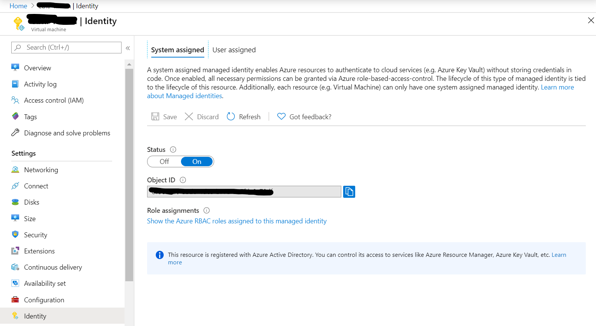
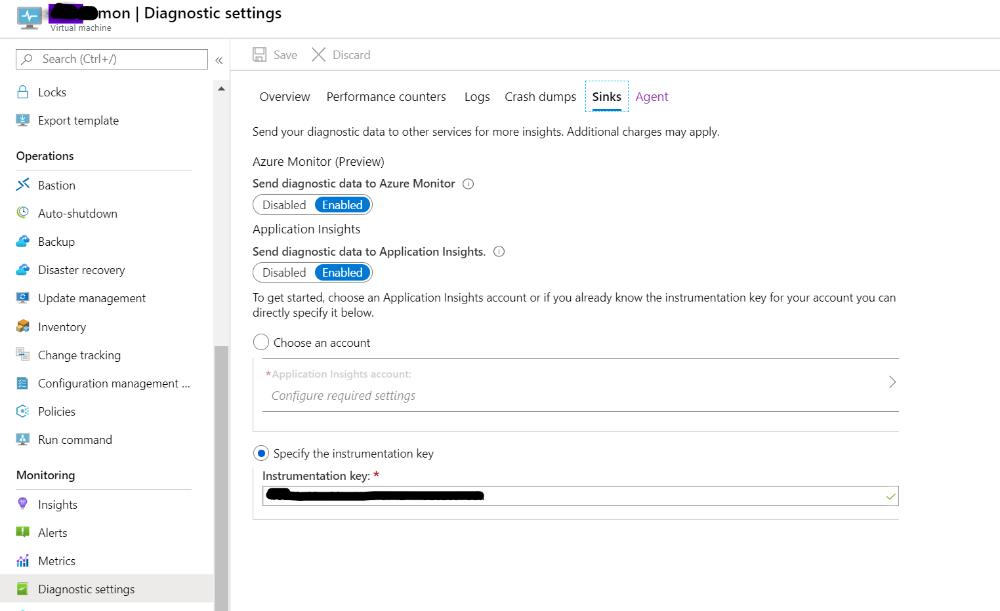

# azure-monitor


### [Azure Monitor data platform](https://docs.microsoft.com/en-us/azure/azure-monitor/platform/data-platform)

Azure Monitor는 metric 수집을 위한 [Metrics 저장소(store)](https://docs.microsoft.com/en-us/azure/azure-monitor/platform/data-platform-metrics)와 Log 수집을 위한 [Log 저장소(store)](https://docs.microsoft.com/en-us/azure/azure-monitor/platform/data-platform-logs)를 제공합니다. 

Metric 저장소는 시계열 데이타를 time-series database인 metric 저장소에 저장합니다. 

Log 저장소인 Log Analytics는 timestamp를 가지고 있는 로그 entry들을 저장하고 또한 빠른 분석을 위한 query 기능을 제공합니다. 

추가로 Application단의 metric 및 로그를 저장 분석을 위한 Application Insights는 Application단의 metric 및 로그를 수집하고 다양한 분석 기능 및 query 기능을 제공합니다. 


### [Azure Diagnostics extension overview](https://docs.microsoft.com/en-us/azure/azure-monitor/platform/diagnostics-extension-overview)

Azure Diagnostics extension은 Virtual Machine의 Guest  OS단의 custom metric에 대한 수집 기능을 제공합니다. 

Azure Diagnostics extension이 수집하는 데이타는 아래와 같습니다. 

#### [Windows diagnostics extension (WAD)](https://docs.microsoft.com/en-us/azure/azure-monitor/platform/diagnostics-extension-overview#windows-diagnostics-extension-wad)

| Data Source                                                  | Description                                                  |
| :----------------------------------------------------------- | :----------------------------------------------------------- |
| Windows Event logs                                           | Events from Windows event log.                               |
| Performance counters                                         | Numerical values measuring performance of different aspects of operating system and workloads. |
| IIS Logs                                                     | Usage information for IIS web sites running on the guest operating system. |
| Application logs                                             | Trace messages written by your application.                  |
| .NET EventSource logs                                        | Code writing events using the .NET [EventSource](https://msdn.microsoft.com/library/system.diagnostics.tracing.eventsource.aspx) class |
| [Manifest based ETW logs](https://docs.microsoft.com/windows/desktop/etw/about-event-tracing) | Event Tracing for Windows events generated by any process.   |
| Crash dumps (logs)                                           | Information about the state of the process if an application crashes. |
| File based logs                                              | Logs created by your application or service.                 |
| Agent diagnostic logs                                        | Information about Azure Diagnostics itself.                  |

#### [Linux diagnostics extension (LAD)](https://docs.microsoft.com/en-us/azure/azure-monitor/platform/diagnostics-extension-overview#linux-diagnostics-extension-lad)

| Data Source          | Description                                                  |
| :------------------- | :----------------------------------------------------------- |
| Syslog               | Events sent to the Linux event logging system.               |
| Performance counters | Numerical values measuring performance of different aspects of operating system and workloads. |
| Log files            | Entries sent to a file based log.                            |


Azure Diagnostics extension은 아래의 기능을 제공합니다. 

- metric/log 데이타를 Azure blob Storage로 전송
- custom metric 데이타를 [Azure Monitor metric store로 전송 (Windows VM only)](https://docs.microsoft.com/en-us/azure/azure-monitor/platform/collect-custom-metrics-guestos-resource-manager-vm). Linux VM의 경우 [Telegraf agent 설치 필요](https://docs.microsoft.com/en-us/azure/azure-monitor/platform/collect-custom-metrics-linux-telegraf)
- metric/log 데이타를 [Event Hub로 전송](https://docs.microsoft.com/en-us/azure/azure-monitor/platform/diagnostics-extension-stream-event-hubs)
- metric/log 데이타를 [Application Insights로 전송](https://docs.microsoft.com/en-us/azure/azure-monitor/platform/diagnostics-extension-to-application-insights)


### Azure Monitor Data Sink

New "AzureMonitor" sink is added from Diagnostics Extension version 1.11. This "AzureMonitor" sink sends Guest OS performance metrics to Azure Monitor metric store.

"Azure Monitor" sink can be enabled at "Diagnostic settings" of Virtual Machine menu on Azure Portal. As of April 2020, this feature is preview but can be enabled on every Azure region with Azure Template. 

To enable "Azure Monitor" sink, a Managed Identity shall be assigned to the VM first so that the VM can access Azure Monitor metrics store. 






### Installing Diagnostics Extension using Terraform

Terraform can be used to deploy Diagnostics Extension in automated manner. It is especially useful to deploy multiple Azure VMs with Diagnostics Extension. 

Sample terraform code can be found [here.](https://github.com/hyundonk/aztf-module-vm/blob/master/vm.tf)

```terraform
resource "azurerm_virtual_machine_extension" "diagnostics" {
	count 						= var.diag_storage_account_name == null ? 0 : var.vm_num
	
	name                        = "Microsoft.Insights.VMDiagnosticsSettings"
	virtual_machine_id			= element(azurerm_virtual_machine.vm.*.id, count.index)

	publisher                   = "Microsoft.Azure.Diagnostics"
	type                 	    = "IaaSDiagnostics"
	type_handler_version 	    = "1.5"

	auto_upgrade_minor_version  = true

	settings = <<SETTINGS
	{
		"xmlCfg"            :  "${base64encode(templatefile("${path.module}/wadcfgxml.tmpl", { resource_id = element(azurerm_virtual_machine.vm.*.id, count.index), instrumentation_key = var.application_insights_key }))}",
    	"storageAccount"    : "${local.storageAccountName}"
	}
	SETTINGS
	
	protected_settings = <<SETTINGS
	{
    	"storageAccountName"		: "${local.storageAccountName}",
		"storageAccountKey" 		: "${var.diag_storage_account_access_key}",
		"storageAccountEndpoint" 	: "${var.diag_storage_account_endpoint}"
	}
	SETTINGS
}
```


[templatefile](https://www.terraform.io/docs/configuration/functions/templatefile.html) function reads the file at the given path and renders its content as a template. In the example above, two template variables are given; virtual machine resource ID and Application Insights instrumentation Key.) 

The [template file](https://github.com/hyundonk/aztf-module-vm/blob/master/wadcfgxml.tmpl) is below.

```
<WadCfg>
	<DiagnosticMonitorConfiguration overallQuotaInMB="4096" xmlns="http://schemas.microsoft.com/ServiceHosting/2010/10/DiagnosticsConfiguration">
	
		<DiagnosticInfrastructureLogs scheduledTransferLogLevelFilter="Error" sinks="ApplicationInsights.Errors"/>
		
		<WindowsEventLog scheduledTransferPeriod="PT1M" sinks="ApplicationInsights.AppLogs">
			<DataSource name="Application!*[System[(Level = 1 or Level = 2)]]"/>
			<DataSource name="Security!*[System[(Level = 1 or Level = 2)]]"/>
			<DataSource name="System!*[System[(Level = 1 or Level = 2)]]"/>
		</WindowsEventLog>
		
    	<Logs scheduledTransferPeriod="PT1M" scheduledTransferLogLevelFilter="Verbose" sinks="ApplicationInsights.AppLogs"/>
    	
		<PerformanceCounters scheduledTransferPeriod="PT1M" sinks="AzMonSink">
			<PerformanceCounterConfiguration counterSpecifier="\Processor(_Total)\% Processor Time" sampleRate="PT15S" unit="Percent"><annotation displayName="CPU utilization" locale="en-us"/></PerformanceCounterConfiguration>
			<PerformanceCounterConfiguration counterSpecifier="\Memory\Available Bytes" sampleRate="PT15S" unit="Bytes"><annotation displayName="Memory available" locale="en-us"/></PerformanceCounterConfiguration>
			<PerformanceCounterConfiguration counterSpecifier="\Process(notepad)\ID Process" sampleRate="PT15S" unit="Count"><annotation displayName="Notepad Process ID" locale="en-us"/></PerformanceCounterConfiguration>
			<PerformanceCounterConfiguration counterSpecifier="\TCPv4\Connections Established" sampleRate="PT15S" unit="Count"><annotation displayName="TCP connections established" locale="en-us" /></PerformanceCounterConfiguration>
			<PerformanceCounterConfiguration counterSpecifier="\Web Service(Default Web Site)\Bytes Received/sec" sampleRate="PT15S" unit="CountPerSecond"><annotation displayName="Web Service(Default Web Site) Bytes Received per sec" locale="en-us"/></PerformanceCounterConfiguration>
			<PerformanceCounterConfiguration counterSpecifier="\Web Service(Default Web Site)\Current Connections" sampleRate="PT15S" unit="Count"><annotation displayName="Web Service(Default Web Site) Current Connections" locale="en-us"/></PerformanceCounterConfiguration>
		</PerformanceCounters>
		
		<Metrics resourceId="${resource_id}">
			<MetricAggregation scheduledTransferPeriod="PT1H"/>
			<MetricAggregation scheduledTransferPeriod="PT1M"/>
		</Metrics>
	</DiagnosticMonitorConfiguration>
	
	<SinksConfig>
		<Sink name="AzMonSink">
			<AzureMonitor></AzureMonitor>
		</Sink>
		
		<Sink name="ApplicationInsights">   
			<ApplicationInsights>${instrumentation_key}</ApplicationInsights>   
			<Channels>   
				<Channel logLevel="Error" name="Errors"  />   
				<Channel logLevel="Verbose" name="AppLogs"  />   
			</Channels>   
		</Sink>   
	</SinksConfig>
</WadCfg>
```


### [Windows diagnostics extension schema](https://docs.microsoft.com/en-us/azure/azure-monitor/platform/diagnostics-extension-schema-windows)

#### WadCFG element

```
<WadCfg>
</WadCfg>
```

#### DiagnosticMonitorConfiguration Element

```
<DiagnosticMonitorConfiguration overallQuotaInMB="4096" xmlns="http://schemas.microsoft.com/ServiceHosting/2010/10/DiagnosticsConfiguration">
</DiagnosticMonitorConfiguration>

#overallQuotaInMB: Azure Diagnostics에 의해 수집하여 로컬디스크에 저장할 수 있는 데이타의 최대크기 (default 4096MB)
```

DiagnosticMonitorConfiguration Element는 아래의 Child element를 가질 수 있습니다. 

| Child Elements               | Description                                                  |
| :--------------------------- | :----------------------------------------------------------- |
| **CrashDumps**               | Enable the collection of crash dumps                         |
| **Logs**                     | Defines the buffer configuration for basic Azure logs        |
| DiagnosticInfrastructureLogs | Enable collection of logs generated by Azure Diagnostics. The diagnostic infrastructure logs are useful for troubleshooting the diagnostics system itself. |
| **Directories**              | Enables the collection of the contents of a directory, IIS failed access request logs and/or IIS logs. |
| **EtwProviders**             | Configures collection of ETW(Event Tracing for Windows) events from EventSource and/or ETW Manifest based providers. |
| Metrics                      | Defines metric aggregation interval (between scheduled transfers to storage rounded up to the nearest minute) |
| **PerformanceCounters**      | Enables the collection of performance counters               |
| **WindowsEventLog**          | Enables the collection of Windows Event Logs.                |
| DockerSources                | collect stats for Docker containers                          |

PerformanceCounters element contains PerformanceCounterConfiguration definitions. Each PerformanceCounterConfiguration defines a custom metric to collect, sampling rate, and unit.

To get a list of supported performance counters on your host, run the command `typeperf`.

```
typeperf -qx
```


#### SinkConfig Element

Defines locations to send diagnostic data to. For example, "AzureMonitor(Metrics store)" or ["ApplicationInsights"](https://docs.microsoft.com/en-us/azure/azure-monitor/platform/diagnostics-extension-to-application-insights) service.

```
<SinksConfig>
	<Sink name="AzMonSink">
		<AzureMonitor></AzureMonitor>
	</Sink>
	
	<Sink name="ApplicationInsights">   
		<ApplicationInsights>${instrumentation_key}</ApplicationInsights>   
		<Channels>   
			# possoble logLevels: Verbose, Information, Warning, Error, and Critical.

			<Channel logLevel="Error" name="Errors"  />   
			<Channel logLevel="Verbose" name="AppLogs"  />   
		</Channels>   
	</Sink>   
</SinksConfig>
```


